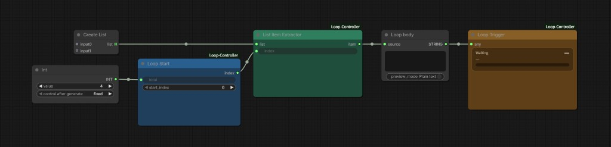

# ComfyUI Loop Controller

English | [中文](README.zh-CN.md)

Queue-based looping for ComfyUI. Each list item runs as its own job. When that job finishes, the next one is queued automatically.

This is not a Python `for` loop inside a single execution. If one item fails, earlier outputs stay on disk and you can resume from that index.

## Install

```bash
cd ComfyUI/custom_nodes
git clone https://github.com/jim-hj-chen/ComfyUI-Loop-Controller.git
```

Restart ComfyUI. Nodes appear under **Loop Controller** (Chinese UI: **循环控制器**). Names and tooltips follow ComfyUI’s language setting.

## Usage



Create List + Int → Loop Start → List Item Extractor → your loop body → Loop Trigger.

1. Set **total** on Loop Start to how many items you want to run.
2. Feed any list-like data into List Item Extractor (lists, batches, or multiline text).
3. Put **Loop Trigger** at the very end, after the save/output node, so the next job is queued only when this one actually completed.

Click **Queue** once. Loop Trigger rewrites `start_index` on Loop Start and submits the next job until `total` is reached.

To resume after a failure, set **start_index** to the failed item and Queue again.

## Nodes

| Node | Role |
| --- | --- |
| **Loop Start** | Emits the current index. On a manual Queue it uses `start_index`. On auto-queued jobs it uses the index written by Loop Trigger. |
| **List Item Extractor** | Takes the full list once and returns only `list[index]`. Empty lists and out-of-range indexes raise immediately. |
| **Loop Trigger** | End-of-graph node. Shows progress and queues the next job while `index + 1 < total`. Duplicate triggers in the same job are ignored. |

## Notes

- One queued job processes one item. ComfyUI will not fan the whole list out inside a single run.
- `total` larger than the list will error on the first invalid index and stop. That is intentional.
- A failed job never reaches Loop Trigger, so the loop stops. Completed jobs are not rolled back.
- Loop Start and Loop Trigger share session state in memory; you do not need to wire them together.
