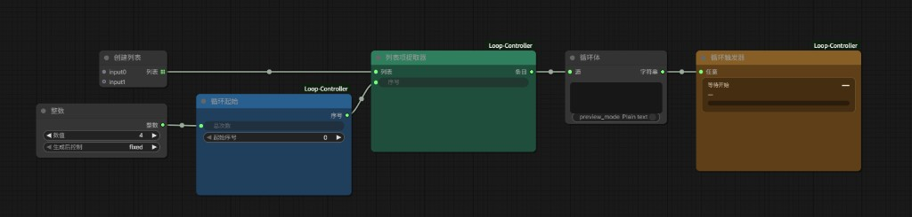

# ComfyUI Loop Controller

[English](README.md) | 中文

面向 ComfyUI 的队列式循环：列表里的每一项作为独立任务执行，当前任务完成后自动排队下一项。

这不是一次执行里的 Python `for` 循环。某一项失败时，已经完成的产出会留在磁盘上，可以从该序号继续。

## 安装

```bash
cd ComfyUI/custom_nodes
git clone https://github.com/jim-hj-chen/ComfyUI-Loop-Controller.git
```

重启 ComfyUI。节点位于 **循环控制器**（英文界面：**Loop Controller**）。名称和提示会跟随 ComfyUI 的语言设置。

## 用法



创建列表 + 整数 → 循环起始 → 列表项提取器 → 你的循环体 → 循环触发器。

1. 在循环起始上把 **总次数** 设为要跑的条数。
2. 把任意列表类数据接到列表项提取器（列表、批量对象，或多行文本）。
3. 把 **循环触发器** 放在最末端、接在保存/输出节点之后，只有本轮真正完成后才会排队下一轮。

点一次 **Queue**。Loop Trigger 会改写 Loop Start 的 `start_index`，并提交下一个任务，直到达到 `total`。

失败后续跑：把 **start_index** 设为失败那一项，再点一次 Queue。

## 节点

| 节点 | 作用 |
| --- | --- |
| **Loop Start**（循环起始） | 输出当前序号。手动 Queue 时使用 `start_index`；自动排队时使用 Loop Trigger 写入的序号。 |
| **List Item Extractor**（列表项提取器） | 一次接收完整列表，只返回 `list[index]`。空列表或索引越界会立即报错。 |
| **Loop Trigger**（循环触发器） | 工作流末端节点。显示进度；在 `index + 1 < total` 时排队下一轮。同一任务内的重复触发会被忽略。 |

## 说明

- 每个排队任务只处理一项。ComfyUI 不会在单次执行里把整份列表隐式展开。
- `total` 大于列表长度时，会在第一个无效索引上报错并停止。这是预期行为。
- 失败的任务走不到 Loop Trigger，循环会停住。已完成任务的产出不会回滚。
- Loop Start 与 Loop Trigger 通过内存共享会话状态，两者之间不必连线。
